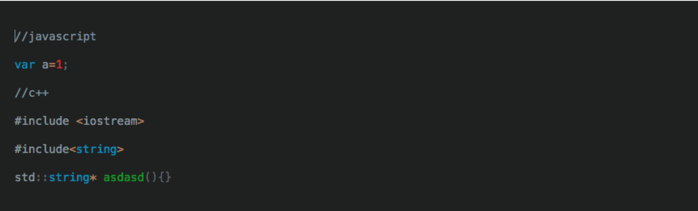
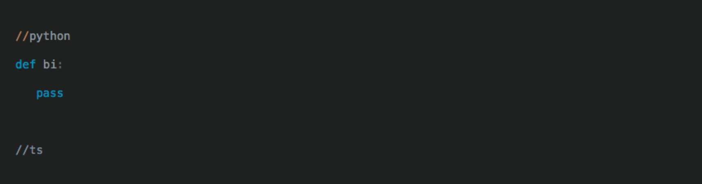

[](https://circleci.com/gh/WuliHole/hole)

# Hole

WuliHole

# Screenshot


### Editor usage
----

  ##### code high light
 Add comment to enable syntax high light.

 The following case is working well
  
  

Some case is not working
```javascript
//ptyhon asdasd         "not working"
/*ptyhon asdasd*/       "not working"

///python               "working"
////////python          "working"
//   python             "working"
//py                    "working"
```

## npm scripts

### Dev
```bash
$ yarn dev:client
```

This runs a development mode server with live reload etc.

Open `http://localhost:8080` in your browser.

### Prodduction
> coming soon

### Tests

#### Single Run
```bash
$ yarn test
```

#### Watch Files
```bash
$ yarn test:watch
```

#### Coverage
```bash
$ yarn cover
```

#### Connecting to remote APIs

Both the devmode and production servers provide a way to proxy requests to
remote HTTP APIs.  This can be useful for working around CORS issues when
developing your software.

Edit [this file](server/proxy-config.js) to mount such APIs at a given path.


